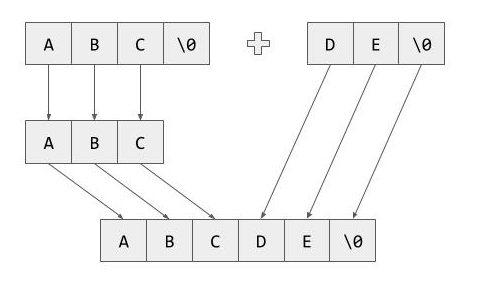

# Implementing a State Machine in C++17 – part 3 - compile-time strings

## Introduction
In previous series of articles ([part1](https://sii.pl/blog/implementing-a-state-machine-in-c17/), [part2](https://sii.pl/blog/implementing-a-state-machine-in-c17-part-2/)) we've played with a simple state machine with some basic functionality. As the machine grows bigger, the need for debugging utilities becomes more important. To implement such utilities we need to do some groundwork first. All state, event, and action names are known at compile-time and for most of them, we could easily generate a string with the name during compilation. What's problematic is that some of the types could be parametrized and would require some form of compile-time string concatenation. That's exactly what we are going to explore in this article :)

## Basics


As most of you probably know, string literals in C++ are of type **`const char[N]`**, and what's more important they always include the terminating null character. Another important fact is that string literals are known at compile-time, which means we can do something like this:

```cpp
constexpr char[] value = "Foo";
```

For each variable marked with **`constexpr`** the compiler enforces that it's value must be calculated during compilation (C++20 expands this idea with **`consteval`** and **`constinit`** keywords, but that's a story for another article). For functions, there's a slight difference. There are some restrictions placed on **`constexpr`** functions so that their return value could be used as a compile-time constant, but what's important is that the compiler will still generate an 'ordinary' (non-constexpr) function that would be used when non-constexpr arguments are passed.

So, getting back to string literals. Unfortunately, there are no easy ways to return a native array from a function. What's even more disappointing is that extra care needs to be taken when passing arrays to functions. Take a look at this example:

```cpp
void trap(const char arr[7])
{
    std::cout << sizeof(arr) << std::endl;
}
```

Since array arguments automatically decay to pointers this code is equivalent to:

```cpp
void trap(const char* arr)
{
    std::cout << sizeof(arr) << std::endl;
}
```

Looks different. Doesn't it? :)
What's even more annoying we cannot use template parameter deduction to 'extract' the size of the array

```cpp
template <typename T, std::size_t N>
void trap(T arr[N]) // <-- This doesn't work
{
    std::cout << (sizeof(T) * N) << std::endl;
}
```

Fortunately, there's a neat little C++ trick that we can use here. Even though arrays automatically decay to pointers, references to arrays do not follow this rule...

```cpp
template <typename T, std::size_t N>
void trap(T (&arr)[N]) // <-- Works!
{
    std::cout << sizeof(arr) << std::endl; // <-- This also works
}
```

The syntax looks a bit odd due to the parenthesis, but at least it works :) . Since storing a reference to an array (which might be a temporary value) is not always the best idea, we'll use **`std::array`** to hold the values. It's just a thin wrapper around a regular array and most of its methods are already **`constexpr`**. A bit of required functionality is missing though, so we'll need to implement it ourselves.

## Extending std::array

As we discussed before, a string literal is just an array of characters and since we'll be working mostly with **`std::array`** we need to have a mechanism to convert one to another. Let's start with the conversion from a regular array. **`std::array`** uses aggregate initialization so we cannot simply pass an array as a constructor argument. So we're on our own here. There are of course multiple ways to do implement such a function. Let's start with something based on index sequences and parameter packs.

```cpp
template <typename T, std::size_t N>
constexpr std::array<T, N> toStdArray(T (&arr)[N])
{
    return toStdArray(arr, std::make_index_sequence<N>());
}
```

The rough idea is quite straightforward. We start with capturing the array by reference, then we create an index sequence from 0 to (N-1) and pass it to a template with a parameter pack

```cpp
template <typename T, std::size_t N, std::size_t... Idx>
constexpr std::array<T, N> toStdArray(T (&arr)[N], std::index_sequence<Idx...>)
{
    return {arr[Idx]...};
}
```

Here we just need to expand the parameter pack containing the indexes and we're ready to construct the array. Note that **`std::index_sequence`** is only used to deduce a parameter pack containing all the numbers 0 to N-1.
Ok, we know how to construct an **`std::array`** out of a regular array. Now we need to implement a function that combines two arrays.

```cpp
template <typename T, std::size_t LeftSize, std::size_t RightSize, std::size_t... LeftIdx, std::size_t... RightIdx>
constexpr std::array<T, LeftSize + RightSize> join(const std::array<T, LeftSize>& lhs,
                                                   const std::array<T, RightSize>& rhs,
                                                   std::index_sequence<LeftIdx...>,
                                                   std::index_sequence<RightIdx...>)
{
    return {lhs[LeftIdx]..., rhs[RightIdx]...};
}

template <typename T, std::size_t LeftSize, std::size_t RightSize>
constexpr std::array<T, LeftSize + RightSize> join(const std::array<T, LeftSize>& lhs,
                                                   const std::array<T, RightSize>& rhs)
{
    return join(lhs, rhs, std::make_index_sequence<LeftSize>(), std::make_index_sequence<RightSize>());
}
```

That's the same idea but with a bit more template parameters :) .

There's one slight detail still missing. Remember that all string literals end with a null value at the end and we don't want that value to end up in the middle of a newly joined string. We need a mechanism to trim or in more general terms, resize the array.

```cpp
template <std::size_t NewSize, typename T, std::size_t OldSize, std::size_t... Indexes>
constexpr std::array<T, NewSize> resize(const std::array<T, OldSize>& arr, std::index_sequence<Indexes...>)
{
    return {arr[Indexes]...};
}

template <std::size_t NewSize, typename T, std::size_t OldSize>
constexpr std::array<T, NewSize> resize(const std::array<T, OldSize>& arr)
{
    constexpr std::size_t minSize = std::min(OldSize, NewSize);
    return resize<NewSize>(arr, std::make_index_sequence<minSize>());
}
```

The biggest difference here is that we can specify the result array size, so we could create a new, bigger array and use the previous one as initial values.

As a last utility function, we'll implement `areEqual`. Even though **`std::array`** provides an equality operator, it's not marked as constexpr (but will be in C++20) and we can't use it. We'll once again use the **`std::index_sequence`** trick, but this time we'll also use a fold expression (introduced in C++17) to generate a big boolean expression comparing all the elements.

```cpp
template <typename T, std::size_t N, std::size_t... Idx>
constexpr bool areEqual(const std::array<T, N>& lhs, const std::array<T, N>& rhs, std::index_sequence<Idx...>)
{
    return ((lhs[Idx] == rhs[Idx]) && ...);
}

template <typename T, std::size_t N>
constexpr bool areEqual(const std::array<T, N>& lhs, const std::array<T, N>& rhs)
{
    return areEqual(lhs, rhs, std::make_index_sequence<N>());
}
```

The fold expression will expand to someting like: `(lhs[0] == rhs[0]) && (lhs[1] == rhs[1]) && ... && (lhs[N-1] == rhs[N-1])` which has this nice property that it will stop at first difference due to short cicuit evaluation.

# Compile time tests

**`constexpr`** modifier on functions allows those functions to be used in static assertions. What we can achieve with it is that we can create simple compile-time tests that could be included in the header. When we make a mistake or a typo the compiler would see a failed **`static_assert`** and stop the compilation with an error. In other words, the code compiles only when all the tests pass, which is pretty neat. On the other hand, we don't want to include test-only code in the resulting binary, so we need to add some special measures to circumvent it.
First of all, it would be a good idea to wrap the code in an anonymous namespace. This causes all the functions in that namespace to have an internal linkage so most compilers would be able to remove those functions if they're not called in the same file. Unfortunately, this also leads to a warning. There's an easy fix for that. We could mark those functions with a **`maybe_unused`** attribute.

```cpp
namespace tests
{
namespace
{

[[maybe_unused]] constexpr void testToStdArray()
{
    constexpr int input[] = {1, 2, 3};
    constexpr auto output = toStdArray(input);
    constexpr std::array<const int, 3> expected = {1, 2, 3};
    static_assert(areEqual(expected, output));
}

[[maybe_unused]] constexpr void testJoin()
{
    constexpr std::array inputA = {1, 2, 3};
    constexpr std::array inputB = {4, 5};
    constexpr std::array expected = {1, 2, 3, 4, 5};
    static_assert(areEqual(expected, join(inputA, inputB)));
}

[[maybe_unused]] constexpr void testResize()
{
    constexpr std::array input = {1, 2, 3};
    constexpr std::array expectedShorter = {1, 2};
    constexpr std::array expectedLonger = {1, 2, 3, 0};
    static_assert(areEqual(expectedShorter, resize<2>(input)));
    static_assert(areEqual(expectedLonger, resize<4>(input)));
}

}
}
```

# Creating **`StaticString`** class

Now we have all the necessary tools to create **`StaticString`** class. The class itself needs to be a template parametrized by string length, but hopefully in most cases, the compiler will be able to deduce the exact value for us. The most convenient way to create a **`StaticString`** instance would be to create it from a string literal and since we plan to store the data in a **`std::array`** let's add another constructor for that case.

```cpp
template <std::size_t N>
class StaticString
{
public:
    constexpr StaticString(const char (&chars)[N])
        : chars(toStdArray(chars))
    {
    }

    constexpr StaticString(std::array<const char, N> chars)
        : chars(std::move(chars))
    {
    }
private:
    std::array<const char, N> chars;
};
```

Now it's time to implement the main functionality - the ability to add two **`StaticStrings`** together. The operation itself is pretty straightforward with two minor details. First of all, we need to consider the null character when joining the strings, but that can be circumvented by simply shrinking the first string by 1 character. The second issue is a bit more subtle. **`StaticStrings`** of different lengths are considered different types and thus cannot access each other's private members. Fortunately, there's a way to fix it without exposing the data to unrelated classes. Friend specification can be introduced as a template, meaning we can give access to a range of types with a single statement.



```cpp
template <std::size_t M>
constexpr StaticString<N + M - 1> operator+(const StaticString<M> &rhs) const
{
    return join(resize<N-1>(chars), rhs.chars);
}

template <std::size_t M>
friend class StaticString;
```

Since we'd like to test our implementation, let's also add an equality operator.

```cpp
constexpr bool operator==(const StaticString<N> &rhs) const
{
    return areEqual(chars, rhs.chars);
}
```

As a bonus, we can provide a getter for data pointer for easier printing later on.

```cpp
constexpr const char* data() const
{
    return chars.data();
}
```

Finally, we can add tests for joining strings to see if they work as planned

```cpp
namespace tests
{
namespace
{

[[maybe_unused]] constexpr void testAdding()
{
    constexpr StaticString lhs{"abc"};
    constexpr StaticString rhs{"de"};
    constexpr StaticString expected{"abcde"};
    static_assert(expected == lhs + rhs);
}

}
}
```

## Looking at the generated code
Let's create a simple test function and look at the disassembled code

```cpp
__attribute__((noinline)) void test()
{
    constexpr StaticString first{"<"};
    constexpr StaticString second{"hello"};
    constexpr StaticString third{">"};
    constexpr StaticString result = first + second + third;
    puts(result.data());
}
```

```asm
0000000000401180 <test()>:
  401180:       50                      push   rax
  401181:       48 b8 3c 68 65 6c 6c    movabs rax,0x3e6f6c6c65683c
  401188:       6f 3e 00
  40118b:       48 89 04 24             mov    QWORD PTR [rsp],rax
  40118f:       48 89 e7                mov    rdi,rsp
  401192:       e8 b9 fe ff ff          call   401050 <puts@plt>
  401197:       58                      pop    rax
  401198:       c3                      ret
  401199:       0f 1f 80 00 00 00 00    nop    DWORD PTR [rax+0x0]
```

As you can see the compiler got rid of most of the copies and reassignments and leaves us with just the evaluated result passed to **`puts`** function.

## Summary
In this article, we explored the possibility to join strings at compile time. The feat itself might not be so impressive, but it's one of the things needed to generate a transition table at compile time. As always, you can find the code in my GitHub repository: ([link](https://github.com/AdamsPL/state-machine/))

In the next article, we'll play a bit with the type system, trying to extract as much information as possible with a hint of functional programming ;)

Stay tuned!
