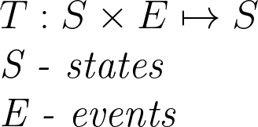
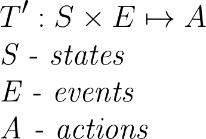

# Implementing a State Machine in C++17 – part 4 - fun with types

## Introduction
In the previous article, we've played with creating and joining strings in compile time. Now with those tools at our disposal, we're ready to challenge the main goal - creating a transition table in compile time.
This article is a part of a bigger series ([part1](https://sii.pl/blog/implementing-a-state-machine-in-c17-part1), [part2](https://sii.pl/blog/implementing-a-state-machine-in-c17-part1), [part3](https://sii.pl/blog/implementing-a-state-machine-in-c17-part3)) and since it references previous solutions and ideas a lot I highly recommend reading all previous articles before reading this one. Also, this part is a bit lengthy so I recommend grabbing a cup of coffee or tea beforehand :)

So, what is a transition table anyway?

## Definition
Let's start with defining a transition function. In essence, it's a function that when given the current state and an event returns the next state the state machine should transition to. Something like this:



Notice that states used in this series return an action instead of the next state, which leads us to a slightly modified definition:



## Problem statement

All possible states and events are known at compile-time and are available directly in the code so using them is trivial. Getting the resulting action is a bit tricky though since it's encoded in the type signature of the handle method. To make things even more complicated, sometimes the handle method could be defined somewhere else or overloaded several times in the inheritance chain. The bottom line is that in the end, the compiler needs to know unambiguously which handle method we want to call and that mechanism is exactly what we're going to use to solve this problem :)

## Using types as values

Most of the time, we think of a type as just a label that's attached to an underlying value. The truth is that we can transform types and use them as values. We just need a container to store the results of our computations. Let's start with something like this:

```cpp
template <typename... Ts>
struct Types
{
};
```

We'll use this structure to bind several types together and manipulate them as a set. Even though it's not a perfect representation of a set (`Types<A, B> != Types<B, A> != Types<B, A, A>`) it's more then enough for our use :) . The first operation we'd need is combining several types into one, which could be implemented like this:

```cpp
template <typename... Lhs, typename... Rhs>
constexpr auto operator+(Types<Lhs...>, Types<Rhs...>)
{
    return Types<Lhs..., Rhs...>{};
}
```

Now it's time to get creative :). As you remember, a transition function accepts a pair of a state and an event. In other words, the domain of such function is the cartesian product of two sets - states and events. What we're trying to achieve here is something along these lines:
```
Types<White, Black> * Types<Cat, Dog> = Types<Types<White, Cat>, Types<White, Dog>, Types<Black, Cat>, Types<Black, Dog>>
```
The reason we need to nest the `Types` structure is that we don't want to lose information on how individual types are grouped while still being able to return a single 'type' that corresponds to the result of the cartesian product. 

Let's start with something simpler:

```
Types<A> * Types<B1, ..., Bn> = Types<Types<A, B>, ..., Types<A, Bn>>
```

It's pretty straightforward. If we have only 1 type on the left we just need to append that type to all types on the right:

```cpp
template <typename Lhs, typename... Rhs>
constexpr auto operator*(Types<Lhs>, Types<Rhs...>)
{
    return Types<Types<Lhs, Rhs>...>{};
}
```

So now what if we have multiple types on the left? We just need to extract each one on the left side, process it as it was a single type, and combine the results
```
Types<A1, ..., Am> * Types<B1, ..., Bn> = Types<A1> * Types<B1, ..., Bn> + ... + Types<Am> * Types<B1, ..., Bn>
```

This is quite easy to implement by using fold expressions from C++17:

```cpp
template <typename... Lhs, typename Rhs>
constexpr auto operator*(Types<Lhs...>, Rhs rhs)
{
    return ((Types<Lhs>{} * rhs) + ...);
}
```

Let's say we have a StateMachine. How do we extract all state types used? Since each StateMachine is parametrized exactly by that information, extracting it is trivial:

```cpp
template <typename... States>
class StateMachine
{
public:
/*...*/
    constexpr static Types<States...> getStateTypes() { return {}; }
/*...*/
};
```

Now. How to check if all of this works? Usually, when writing some template and type intensive code I use a simple debug utility that helps me print the underlying types. It can be implemented like this:

```cpp
template <typename T>
void debug(T&&)
{
    std::cerr << __PRETTY_FUNCTION__ << std::endl;
}
```

Unfortunately `__PRETTY_FUNCTION__` is not part of the standard, but both gcc and clang implement so it's likely that it's already available in your toolchain :)

Great! Let's run it on the door example we used in previous articles and see how it works:

```cpp
Types stateTypes = Door::getStateTypes();
Types<OpenEvent, CloseEvent, LockEvent, UnlockEvent> eventTypes;
debug(stateTypes * eventTypes);
```

We should see an output similar to this:

```
void debug(T &&) [T = Types<Types<ClosedState, OpenEvent>, Types<ClosedState, CloseEvent>, Types<ClosedState, LockEvent>, Types<ClosedState, UnlockEvent>, Types<OpenState, OpenEvent>, Types<OpenState, CloseEvent>, Types<OpenState, LockEvent>, Types<OpenState, UnlockEvent>, Types<LockedState, OpenEvent>, Types<LockedState, CloseEvent>, Types<LockedState, LockEvent>, Types<LockedState, UnlockEvent> >]
```

## Making it functional

The biggest gain of having a dedicated object representing a set of possible types is the possibility to perform different transformations on it. Let's use the 'pipe' operator to execute an operation on all stored types.

```cpp
template <typename... Ts, typename Operation>
constexpr auto operator|(Types<Ts...>, Operation oper)
{
    return oper(Types<Ts>{}...);
}
```

Even though this implementation is quite flexible (since we can return any type) it's not very convenient. In most cases, we want to execute something on each held type and then combine the results. A simple wrapper can help us with that

```cpp
template <typename Operation>
class MapAndJoin
{
public:
    constexpr MapAndJoin(Operation operation)
        : operation(std::move(operation))
    {
    }

    template <typename... Ts>
    constexpr auto operator()(Types<Ts>... rhs)
    {
        return (operation(rhs) + ...);
    }

private:
    Operation operation;
};
```

The overall idea is quite simple. We use fold expressions to call `operation` on each type and then we join the results by adding them together.

The next step is to transform our set of state-event pairs into a set of underlying actions.

```cpp
struct ResolveAction
{
    template <typename State, typename Event>
    constexpr auto operator()(Types<State, Event>)
    {
        using Action = decltype(std::declval<State>().handle(std::declval<Event>()));
        return Types<Action>{};
    }

    template <typename State, typename Event>
    constexpr auto operator()(Types<Types<State, Event>>)
    {
        return (*this)(Types<State, Event>{});
    }
};
```

`std::declval` allows us to 'pretend' that we have an object of a given type, which is handy, especially when dealing with overloaded functions such as `handle`. And why there's a double nested Types overload you might ask? It comes down to how `MapAndJoin` works. `Types<A, B, C>` will be converted to `oper(Types<A>{}) + oper(Types<B>{}) + oper(Types<C>{})`. Let's run it on our example and see how it works

```
void debug(T &&) [T = Types<TransitionTo<OpenState>, Nothing, TransitionTo<LockedState>, Nothing, Nothing, TransitionTo<ClosedState>, Nothing, Nothing, Nothing, Nothing, Nothing, Maybe<TransitionTo<ClosedState>>>]
```

Awesome! :)

## Generating strings

Most of the work done so far was related to manipulating types. It's time to convert those types into compile-time strings that we can print later on. Let's assume that for user-defined states and events exists a 'stringification' function. To eliminate a bit of boilerplate, we can write a preprocessor macro to generate all the needed implementations:

```cpp
#define STRINGIFY_IMPL(TYPE) [[maybe_unused]] static constexpr auto stringify(Types<TYPE>) { return StaticString{#TYPE}; }

STRINGIFY_IMPL(OpenEvent)
STRINGIFY_IMPL(CloseEvent)
STRINGIFY_IMPL(LockEvent)
STRINGIFY_IMPL(UnlockEvent)

STRINGIFY_IMPL(ClosedState)
STRINGIFY_IMPL(OpenState)
STRINGIFY_IMPL(LockedState)
```

Now, what about stringifying actions? It's a bit more difficult since actions can be parametrized by other actions/states/events. Thankfully, since we can combine strings in compile time we can generate the string for a subexpression and join it with a known prefix or suffix. Let's implement it for actions used in our example

```cpp
template <typename State>
static constexpr auto stringify(Types<TransitionTo<State>>) { return StaticString{"TransitionTo<"} + stringify(Types<State>{}) + StaticString{">"}; }

template <typename Action>
static constexpr auto stringify(Types<Maybe<Action>>) { return StaticString{"Maybe<"} + stringify(Types<Action>{}) + StaticString{">"}; }

static constexpr auto stringify(Types<Nothing>) { return StaticString{"Nothing"}; }
```

Assuming we know how to stringify each state, event, and action used in our example we can proceed to generate the transition table. The table itself will be quite simple. In the first row, we'll list all the events and in the first column, we'll list all the states. The rest will be actions executed when we handle a given event in a particular state. Since both the first row and first column are displayed a bit differently, let's add a dummy marker type - `Header` to handle such cases. Additionally, in the future, we might want to change the format of the strings so let's create a separate `Stringifier` class that'd responsible for generating all the strings:

```cpp

struct Header {};

struct SimpleStringifier
{
    constexpr auto operator()(Types<Header>) const
    {
        return StaticString{""};
    }

    template <typename T>
    constexpr auto operator()(Types<T> type) const
    {
        return stringify(type);
    }
};

template <typename Stringifier, typename State>
class GenerateRow
{
public:
    constexpr GenerateRow(Stringifier str, Types<State>)
        : str(str)
    {
    }

    constexpr auto operator()(Types<State> state) const
    {
        return str(state);
    }

    template <typename Event>
    constexpr auto operator()(Types<Event>) const
    {
        auto action = ResolveAction{}(Types<Types<State, Event>>{});
        return StaticString{" | "} + str(action);
    }

private:
    const Stringifier str;
};

template <typename Stringifier>
class GenerateRow<Stringifier, Header>
{
public:
    constexpr GenerateRow(Stringifier str, Types<Header>)
        : str(str)
    {
    }

    constexpr auto operator()(Types<Header> header) const
    {
        return str(header);
    }

    template <typename Event>
    constexpr auto operator()(Types<Event> event) const
    {
        return StaticString{" | "} + str(event);
    }

private:
    const Stringifier str;
};

template <typename Stringifier, typename... Events>
class GenerateTable
{
public:
    constexpr GenerateTable(Stringifier str, Types<Events...>)
        : str(str)
    {
    }

    template <typename State>
    constexpr auto operator()(Types<State> state) const
    {
        return (Types<State, Events...>{} | MapAndJoin{GenerateRow{str, state}}) + StaticString{"\n"};
    }

private:
    const Stringifier str;
};

template <typename... StateTypes, typename... EventTypes>
constexpr auto generateTransitionTable(Types<StateTypes...> states, Types<EventTypes...> events)
{
    constexpr SimpleStringifier stringifier;
    constexpr auto result = (Types<Header>{} + states) | MapAndJoin{GenerateTable{stringifier, events}};
    return result;
}

int main()
{
    std::cout << generateTransitionTable(Door::getStateTypes(), Types<OpenEvent, CloseEvent, LockEvent, UnlockEvent>{}).data() << std::endl;
    return 0;
}
```

The trick here is that we have a partial specialization for GenerateRow. This allows us to switch implementation for header rows and use the default for others. Let's give it a go:

```
 | OpenEvent | CloseEvent | LockEvent | UnlockEvent
ClosedState , TransitionTo<OpenState> , Nothing , TransitionTo<LockedState> , Nothing
OpenState , Nothing , TransitionTo<ClosedState> , Nothing , Nothing
LockedState , Nothing , Nothing , Nothing , Maybe<TransitionTo<ClosedState>>
```

## Making it pretty
As you can see the table is pretty wobbly due to different cell widths. There are a couple of ways to fix it. For now, let's calculate the maximum width of all cells, and let's fill smaller cells with spaces accordingly. Let's start by adding the ability to resize to our compile-time strings. We already have a `resize` function for std::array. The problem is that when it is expanding the array it leaves excess elements default-initialized, whereas we want them to be initialized to spaces. Let's modify our implementation to allow providing a default filler value

```cpp
template <std::size_t NewSize, typename T, std::size_t OldSize, std::size_t... Indexes>
constexpr std::array<T, NewSize> resize(const std::array<T, OldSize>& arr, std::remove_const_t<T> defaultValue, std::index_sequence<Indexes...>)
{
    return {((Indexes < OldSize) ? arr[Indexes] : defaultValue)...};
}

template <std::size_t NewSize, typename T, std::size_t OldSize>
constexpr std::array<T, NewSize> resize(const std::array<T, OldSize>& arr, std::remove_const_t<T> defaultValue)
{
    return resize<NewSize>(arr, defaultValue, std::make_index_sequence<NewSize>());
}
```

That `std::remove_const_t<T>` might need a bit of explaining. Our compile strings use `const char` as the underlying type, but passing a char literal would deduce `char`. Since `T` cannot be both deduced as `const char` and `char` compiler raises a compilation error. Wrapping `T` in a std::remove_const_t has a side effect that it stops deducing T from it.
What's left is a `changeSize` implementation for `StaticString`

```cpp
template <std::size_t TargetLen>
constexpr StaticString<TargetLen + 1> changeLength(char fill) const
{
    constexpr std::array<const char, 1> stringEnd{'\0'};
    return join(resize<TargetLen>(resize<N-1>(chars, fill), fill), stringEnd);
}
```

First, we trim the trailing `\0` character, then we resize it and we append '\0' at the end.

So how to calculate the maximum length of all strings used in the table? Let's start by adding a small utility function to `StaticString` class:

```cpp
constexpr std::size_t length() const
{
    return N - 1;
}
```

It's pretty straightforward and it will be quite useful in a moment :)

Provided we have a bunch of states and actions wrapped in `Types`, we can calculate the max size as follows:

```cpp
template <std::size_t X>
struct Maximum
{
    template <std::size_t Y>
    constexpr auto operator+(Maximum<Y>)
    {
        return Maximum<std::max(X, Y)>{};
    }

    static constexpr auto value()
    {
        return X;
    }
};

struct CalculateMaxLength
{
    template <typename T>
    constexpr auto operator()(Types<T> type)
    {
        return Maximum<stringify(type).length()>{};
    }
};

/*
...
*/
    constexpr auto actions = (states * events) | MapAndJoin(ResolveAction{});
    constexpr auto maxWidth = (states + events + actions) | MapAndJoin(CalculateMaxLength{});
/*
...
*/
```

We start by calculating all the resulting actions. Then we calculate the maximum length for all states, events, and actions combined. Do you remember how `MapAndJoin` was defined? For each type, it executes the provided operation and 'glues' the results together by calling '+' on them. This way we can define a special `Maximum` type that takes the maximum of two numbers when 'added'.
The only thing left is to create a new 'stringifier' that will expand all the strings if necessary:

```cpp
template <std::size_t Width>
struct ConstantWidthStringifier
{
    constexpr auto operator()(Types<Header>) const
    {
        return StaticString{""}.template changeLength<Width>(' ');
    }

    template <typename T>
    constexpr auto operator()(Types<T> type) const
    {
        return stringify(type).template changeLength<Width>(' ');
    }
};

template <typename... StateTypes, typename... EventTypes>
constexpr auto generatePrettyTransitionTable(Types<StateTypes...> states, Types<EventTypes...> events)
{
    constexpr auto actions = (states * events) | MapAndJoin(ResolveAction{});
    constexpr auto maxWidth = (states + events + actions) | MapAndJoin(CalculateMaxLength{});
    constexpr ConstantWidthStringifier<maxWidth.value()> stringifier{};
    constexpr auto result = (Types<Header>{} + states) | MapAndJoin{GenerateTable{stringifier, events}};
    return result;
}
```

The output of this function looks like this:

```
                                 | OpenEvent                        | CloseEvent                       | LockEvent                        | UnlockEvent
ClosedState                      | TransitionTo<OpenState>          | Nothing                          | TransitionTo<LockedState>        | Nothing
OpenState                        | Nothing                          | TransitionTo<ClosedState>        | Nothing                          | Nothing
LockedState                      | Nothing                          | Nothing                          | Nothing                          | Maybe<TransitionTo<ClosedState>>
```

Success! :)
The whole transition table for our toy state machine was reduced to a single compile-time string. I hope it shows how much can be achieved in compile-time by leveraging type information :)

## Final word

This article ends a rather long series of articles related to a possible implementation of a State Machine by using features from C++17. We've covered different topics, from the state machine itself, through different compile-time debug utilities and a hint of functional type-based calculations :). I hope you had as much fun reading it as I had writing it :). As always, all the code and the examples used are available in my GitHub repository: ([link](https://github.com/AdamsPL/state-machine/)).
